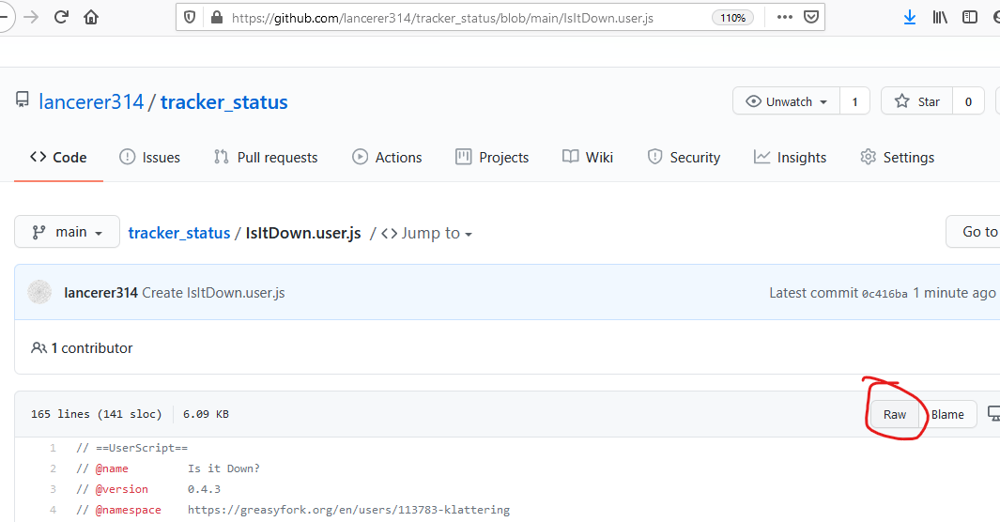

# tracker_status
A tracker status [greasemonkey](https://www.greasespot.net/) extension for [RED](https://redacted.ch) forked from https://greasyfork.org/en/scripts/395736-is-it-down on March 24 2021 (version 0.4.3)

## Installation
Assumming GreaseMonkey extension is installed and active on the browser you are using, go to the [script page](https://github.com/lancerer314/tracker_status/blob/main/IsItDown.user.js) and click on the "raw" button

