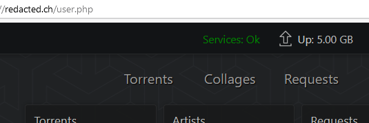

# tracker_status
A tracker status [tampermonkey](https://www.tampermonkey.net/)/[greasemonkey](https://www.greasespot.net/) user script for [RED](https://redacted.ch) inspired from https://greasyfork.org/en/scripts/395736-is-it-down (version 0.4.3)

## Installation

The easiest way is to install from https://greasyfork.org/en/scripts/423981-tracker-status

You can also go to the [script page](https://github.com/lancerer314/tracker_status/blob/main/trackerStatus.user.js) and click on the "raw" button


## What it does
When displaying the homepage of RED you will see the overall status of the trackers and IRC



By clicking it you will open a tab on the site [red.trackerstatus.info](https://red.trackerstatus.info/)

In case one service is down, you can se the detail of each service by moving your mouse over it


## How it works

The scripts send a POST request to the [red.trackerstatus.info API](https://red.trackerstatus.info/api/) to retrieve status of the tracker, website,... 
Here is an example of response :
```
{
    "Website": {
        "Status": "1",
        "Latency": "16ms",
        "CurrentUptime": "19955",
        "UptimeRecord": "121077",
        "CurrentDowntime": "0"
    },
    "TrackerHTTP": {
        "Status": "1",
        "Latency": "30ms",
        "CurrentUptime": "29197",
        "UptimeRecord": "83546",
        "CurrentDowntime": "0"
    },
    "TrackerHTTPS": {
        "Status": "1",
        "Latency": "16ms",
        "CurrentUptime": "136",
        "UptimeRecord": "73539",
        "CurrentDowntime": "0"
    },
    "IRC": {
        "Status": "1",
        "Latency": "23ms",
        "CurrentUptime": "29208",
        "UptimeRecord": "369746",
        "CurrentDowntime": "0"
    },
    "IRCTorrentAnnouncer": {
        "Status": "1",
        "Latency": "online",
        "CurrentUptime": "419",
        "UptimeRecord": "59089",
        "CurrentDowntime": "0"
    },
    "IRCUserIdentifier": {
        "Status": "1",
        "Latency": "online",
        "CurrentUptime": "427",
        "UptimeRecord": "306740",
        "CurrentDowntime": "0"
    },
    "tweet": {
        "date": "27th of March 2019",
        "unix": "1553728335",
        "message": "As of 6 hours ago main site and tracker services have been restored."
    }
}
```
